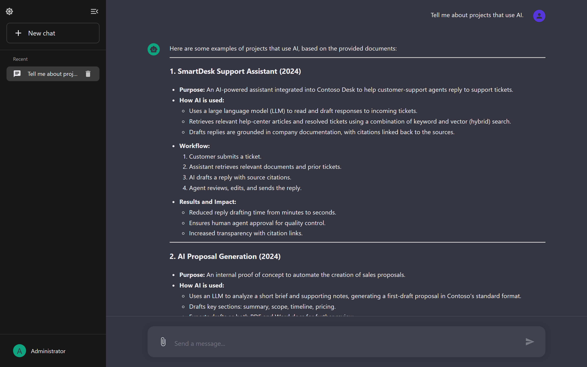
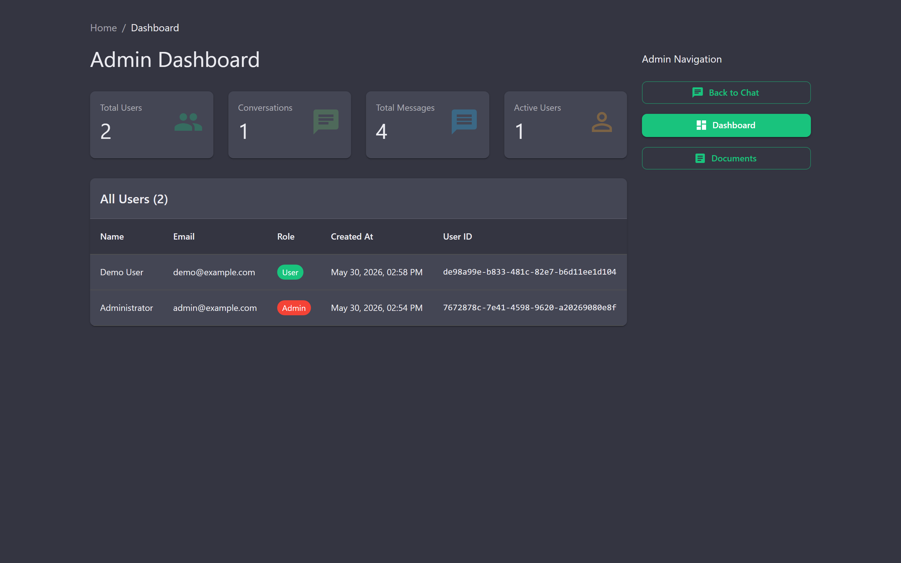
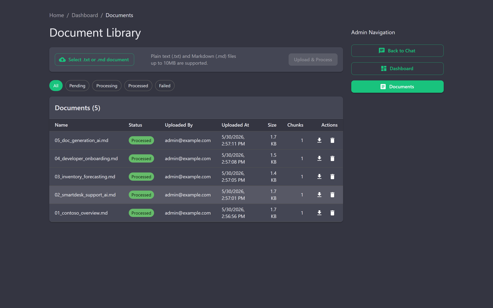
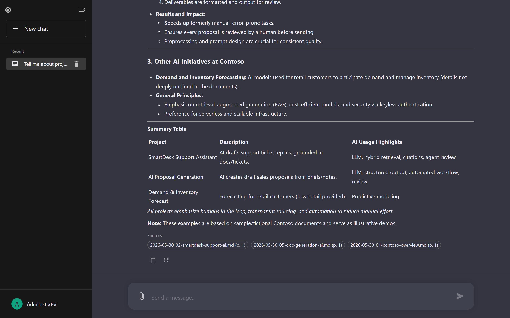
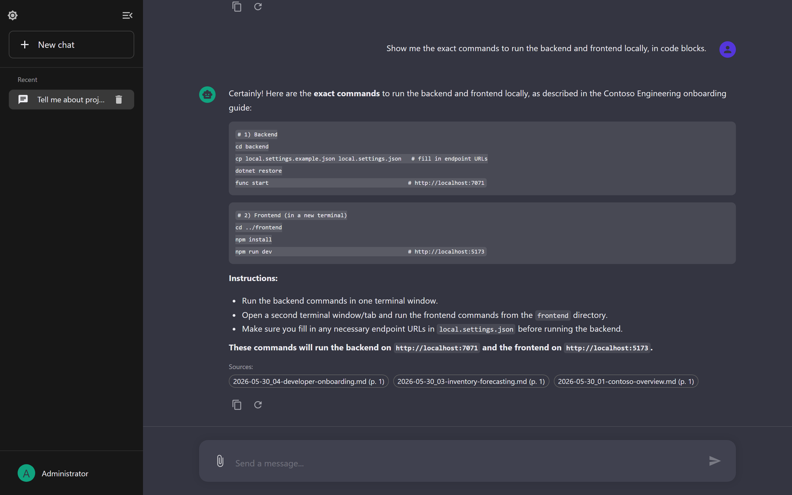
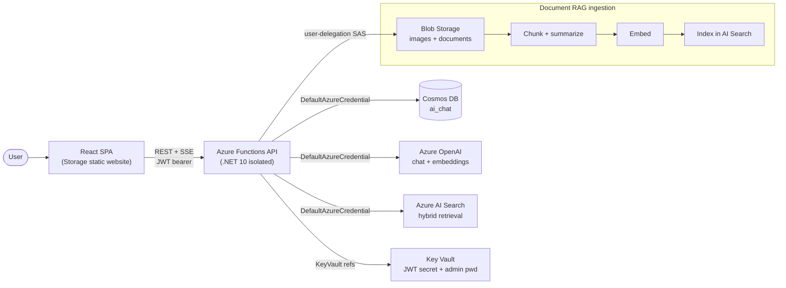

<div align="center">

# AI RAG Chat Bot

### Streaming AI chat with image understanding and retrieval-augmented generation over your own documents: keyless Azure, one-command deploy

[](https://github.com/derekhuynen/ai-rag-chat-bot/actions/workflows/ci.yml)
[](LICENSE)


[](https://github.com/derekhuynen/ai-rag-chat-bot/stargazers)



</div>

A production-grade reference app: **Azure Functions (.NET 10) + React**, Semantic Kernel, and Azure AI Search, wired up keyless with Managed Identity and deployable to a cheap, scale-to-zero Azure environment in a single command.

_Built for fun: a personal project exploring how far a fully keyless, scale-to-zero RAG stack on Azure can go. It is a demo and portfolio piece, not a commercial product, but everything here actually runs._

---

## Why you might like this

- **Keyless, end to end.** Cosmos DB, Azure OpenAI, Azure AI Search, and Storage all auth via `DefaultAzureCredential`: Managed Identity in the cloud, `az login` locally. No API keys or connection strings anywhere.
- **Real-time streaming chat** over Server-Sent Events, with multi-turn history persisted in Cosmos DB and one-click regenerate.
- **Hybrid RAG** (keyword + vector) over your own `.txt`/`.md` docs, with clickable citations back to the source.
- **Image understanding**: paste, drag-and-drop, or upload images straight into the chat.
- **Cheap by design**: Flex Consumption Functions, serverless Cosmos, Free-tier AI Search, Storage static website. Scales to zero; ~$0 at idle.
- **One command up, one command down**: Bicep IaC with `deploy.ps1` / `teardown.ps1`, plus OIDC-based GitHub Actions CI/CD (no stored cloud secrets).
- **Tested and CI-gated**: xUnit (backend) + Vitest/RTL (frontend) run on every push.

<details>
<summary>More screenshots</summary>






</details>

---

## Tech stack

| Layer | Tech |
|-------|------|
| **Backend** | Azure Functions v4, **.NET 10** isolated worker, Semantic Kernel |
| **Frontend** | **React 19** + TypeScript (Vite), MUI, TanStack Query, react-hook-form + Zod |
| **AI** | Azure OpenAI (GPT-4.1 chat + `text-embedding-3-small`) |
| **Data / Search** | Azure Cosmos DB · Azure AI Search (hybrid) · Azure Blob Storage |
| **Infra** | Bicep · Key Vault · Managed Identity · GitHub Actions (OIDC) |

---

## Quick start

### Option A: Deploy to Azure (cheap, one command)

Infrastructure lives in [`infra/`](infra/README.md) (Bicep + `az`). Spin up a full, cheap environment: Free AI Search, serverless Cosmos, Flex Consumption Functions, a Storage static website for the SPA, and Azure OpenAI (S0):

```powershell
cd infra
./deploy.ps1 -Location eastus2 -ResourceGroupName rg-ragchat -SearchSku free
```

Load the bundled sample documents (`demo/documents/`) so the chat has something to ground answers on:

```powershell
cd infra
./seed-demo.ps1 -ApiBaseUrl <API base URL from deploy.ps1> -AdminPassword (Read-Host "Admin password" -AsSecureString)
```

Tear it all back down (the whole resource group) with:

```powershell
cd infra
./teardown.ps1 -ResourceGroupName rg-ragchat
```

See [`infra/README.md`](infra/README.md) for prerequisites, the one-time GitHub Actions OIDC setup, and cost/region caveats.

### Option B: Run locally

> The app is **keyless** and talks to real Azure resources (no local emulators for AI Search / OpenAI), so you'll point at deployed services and authenticate with `az login`. The easiest path is to run `deploy.ps1 -DevPrincipalId <your-object-id>` once, then run the app locally against those cheap resources.

```bash
git clone https://github.com/derekhuynen/ai-rag-chat-bot.git
cd ai-rag-chat-bot

# 1) Backend
cd backend
cp local.settings.example.json local.settings.json   # Windows: copy
#   fill in your endpoint URLs (no keys needed, it's keyless)
dotnet restore
func start                                            # → http://localhost:7071/api

# 2) Frontend (new terminal)
cd ../frontend
npm install
echo VITE_API_BASE_URL=http://localhost:7071/api > .env
npm run dev                                           # → http://localhost:5173
```

---

## Architecture



All app-to-Azure calls are **keyless** (Managed Identity in Azure, `az login` locally via `DefaultAzureCredential`). The only stored secrets are the JWT signing key and the admin password, held in Key Vault.

**Backend:** Azure Functions v4 / .NET 10 isolated · Cosmos DB (`ai_chat`) · Blob Storage (`ai-chat`) · Azure OpenAI (GPT-4.1 + `text-embedding-3-small`) · Azure AI Search (`ai-chat-documents`, hybrid) · JWT (HS256) auth.

**Frontend:** React + TypeScript (Vite) · MUI dark theme · TanStack Query · react-hook-form + Zod · Axios for REST and native `fetch` for SSE streaming.

Deeper dives: [backend architecture](documents/backend_architecture.md) · [frontend architecture](documents/frontend_architecture.md).

<details>
<summary>Project structure</summary>

```text
ai-rag-chat-bot/
├── backend/                    # Azure Functions backend (.NET 10 isolated)
│   ├── Functions/              # HTTP-triggered functions
│   │   ├── AuthFunction.cs         # Auth endpoints (login, register, me)
│   │   ├── AdminFunction.cs        # Admin dashboard endpoints
│   │   ├── ConversationFunction.cs # Conversation CRUD
│   │   ├── ChatFunction.cs         # Non-streaming chat (optional)
│   │   ├── ChatStreamFunction.cs   # Streaming chat (SSE)
│   │   ├── ImageUploadFunction.cs  # Image upload
│   │   └── DocumentManagementFunction.cs # Admin document upload + RAG mgmt
│   ├── Services/               # Business logic & integrations
│   ├── Models/                 # Cosmos DB and API models
│   ├── Setup/                  # Cosmos DB + admin bootstrap
│   └── AzureFunctionApp.Tests/ # xUnit test suite
├── frontend/                   # React + MUI frontend (Vitest tests)
│   └── src/                    # components, pages, services, hooks, utils
├── infra/                      # Bicep + deploy/teardown/seed scripts (cheap, keyless Azure)
├── demo/                       # Fictional sample docs to seed RAG for the demo
├── scripts/                    # Tooling (Playwright screenshot capture)
└── documents/                  # Backend & frontend architecture docs
```

</details>

---

## Security

- **Keyless by default**: no service keys or connection strings stored anywhere; everything authenticates via `DefaultAzureCredential`.
- The only application secrets are `Jwt:SecretKey` and `Admin:Password`: local in gitignored `local.settings.json`, in Azure stored in **Key Vault** and referenced from Function App settings.
- JWTs are signed (HS256, ≥256-bit key enforced) and validated on every protected endpoint; admin role is re-checked against the database.
- Cosmos queries are parameterized; Blob access uses short-lived **user-delegation SAS** (no account key).
- `.env` and `local.settings.json` are gitignored: never commit secrets.

<details>
<summary>Configuration reference (<code>local.settings.json</code>)</summary>

The app is keyless, so this file holds **endpoints and account names** plus the `Jwt` and `Admin` values: **not access keys**. Example (also at [`backend/local.settings.example.json`](backend/local.settings.example.json)):

```json
{
  "IsEncrypted": false,
  "Values": {
    "AzureWebJobsStorage": "UseDevelopmentStorage=true",
    "FUNCTIONS_WORKER_RUNTIME": "dotnet-isolated",
    "CosmosDb:Endpoint": "https://YOUR_COSMOS_ACCOUNT.documents.azure.com:443/",
    "CosmosDb:DatabaseName": "ai_chat",
    "AzureAI:Endpoint": "https://YOUR_AZURE_OPENAI.openai.azure.com/",
    "AzureAI:DeploymentName": "gpt-4.1",
    "AzureAI:AvailableModels": "gpt-4.1",
    "AzureAI:EmbeddingDeployment": "text-embedding-3-small",
    "AzureSearch:Endpoint": "https://YOUR_SEARCH_SERVICE.search.windows.net",
    "AzureSearch:IndexName": "ai-chat-documents",
    "AzureStorage:AccountName": "YOUR_STORAGE_ACCOUNT",
    "AzureStorage:ContainerName": "ai-chat",
    "AzureStorage:ImageFolder": "images",
    "AzureStorage:DocumentFolder": "documents",
    "AzureStorage:QueueName": "document-processing-queue",
    "DocumentProcessing:ChunkSize": "800",
    "DocumentProcessing:ChunkOverlap": "200",
    "DocumentProcessing:MaxFileSize": "10485760",
    "RAG:MinRelevanceScore": "0.7",
    "RAG:MaxResults": "3",
    "RAG:SemanticWeight": "0.7",
    "Jwt:SecretKey": "CHANGE_ME_TO_A_SECURE_RANDOM_SECRET",
    "Jwt:Issuer": "AIChatBot",
    "Jwt:Audience": "AIChatBot",
    "Jwt:ExpirationMinutes": "1440",
    "Admin:Email": "admin@example.com",
    "Admin:Password": "ChangeThisAdminPassword123!",
    "Admin:Name": "Administrator"
  },
  "Host": { "CORS": "*" }
}
```

The frontend reads the backend URL from `VITE_API_BASE_URL` (in `frontend/.env`); for local dev that's `http://localhost:7071/api`.

</details>

---

## Status and roadmap

**Done:** streaming chat + history · admin dashboard · RAG ingestion (upload → chunk → embed → search) · markdown rendering & regenerate · keyless Managed-Identity auth · one-command cheap Azure deploy · OIDC CI/CD · automated tests.

**Next:** model selection in the chat UI · user settings (theme, default model).

---

## Contributing and license

Contributions welcome: see [CONTRIBUTING.md](CONTRIBUTING.md) for local setup, the checks CI runs (build, lint, tests), and commit/branch conventions. Released under the [MIT License](LICENSE).

If this project helped or inspired you, a star is appreciated.
