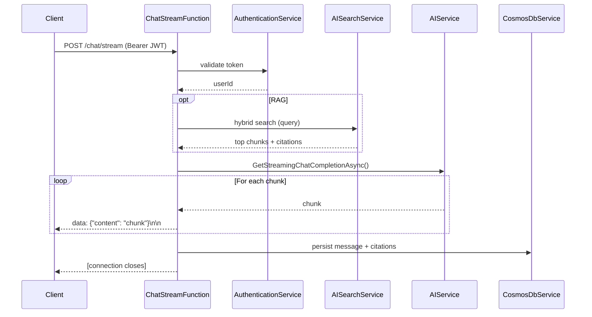
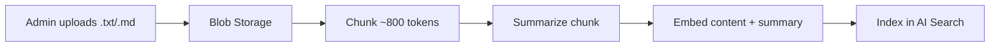

# Backend Architecture

## Overview

The backend is an **Azure Functions v4** app on the **.NET 10 isolated worker**, following a clean separation of concerns (thin HTTP functions over a service layer). It provides JWT-secured chat, conversation history, image upload, and admin-managed RAG over documents stored in Azure.

Every call to Azure is **keyless**: services authenticate with `DefaultAzureCredential` (Managed Identity in the cloud, your `az login` locally). There are no account keys or connection strings in configuration.

## Technology stack

- **Runtime:** .NET 10 (isolated worker model)
- **Framework:** Azure Functions v4
- **AI:** Azure OpenAI via Semantic Kernel (GPT-4.1 chat + `text-embedding-3-small` embeddings)
- **Database:** Azure Cosmos DB (NoSQL, database `ai_chat`)
- **Search:** Azure AI Search (index `ai-chat-documents`, hybrid retrieval)
- **Storage:** Azure Blob Storage (container `ai-chat` for images and documents)
- **Auth:** JWT (HS256), passwords hashed with BCrypt.Net-Next

## Project structure

```
backend/
├── Functions/                      # HTTP-triggered Azure Functions (thin controllers)
│   ├── AuthFunction.cs                 # register, login, me
│   ├── AdminFunction.cs                # admin stats + user list (/management/*)
│   ├── ConversationFunction.cs         # conversation CRUD
│   ├── ChatFunction.cs                 # non-streaming chat (optional)
│   ├── ChatStreamFunction.cs           # streaming chat (SSE)
│   ├── ImageUploadFunction.cs          # image upload for chat
│   ├── DocumentUploadFunction.cs       # in-chat document attachment upload
│   ├── DocumentManagementFunction.cs   # admin document upload + RAG management
│   └── HealthCheckFunction.cs          # health probe
├── Services/                       # Business logic and external integrations
│   ├── AuthenticationService / JwtTokenService / PasswordHashService
│   ├── CosmosDbService             # users, conversations, documents
│   ├── AIService                   # chat completion (streaming + non-streaming)
│   ├── AISearchService             # hybrid retrieval over the RAG index
│   ├── DocumentProcessingService   # chunk, summarize, embed
│   ├── DocumentParserService       # extract text from uploads
│   └── BlobStorageService          # blob upload + user-delegation SAS
├── Repositories/                   # CosmosDbRepository (data access)
├── Models/                         # Cosmos and API models
├── Setup/                          # CosmosDbSetup + AdminSetup (run at startup)
├── Utils/                          # DocumentValidator, ImageValidator
└── Program.cs                      # dependency injection and startup
```

Each service has an interface for testability and loose coupling. Functions validate auth, call a service, and shape the response; logic lives in the services.

## Core services

### AuthenticationService
Centralizes request authentication and authorization. Validates the bearer JWT, extracts the principal, and (for admin routes) re-checks the admin role against the database rather than trusting the token alone.

### JwtTokenService
Generates and validates HS256 JWTs. Tokens carry id, email, name, and role claims; expiration is configurable (`Jwt:ExpirationMinutes`, default 24h). The signing key (`Jwt:SecretKey`) must be at least 256 bits.

### CosmosDbService
Data operations for users, conversations (with embedded messages), and RAG document records.

- Database: `ai_chat`
- Containers:
  - `Users` (partitioned by `/id`)
  - `Conversations` (partitioned by `/userId`; messages are embedded in the conversation document)
  - `Documents` (partitioned by `/id`)

Queries that take user input use parameterized `QueryDefinition`.

### AIService
Integration with Azure OpenAI via Semantic Kernel.

- `GetStreamingChatCompletionAsync()` yields chunks for SSE streaming.
- `GetChatCompletionAsync()` non-streaming completion (used by the optional `ChatFunction`).
- Builds context from conversation history, attached images, document text, and retrieved RAG chunks.

### AISearchService
Access to the `ai-chat-documents` index.

- Indexes `DocumentChunk` records (content + summary, each with a 1536-dim vector).
- **Hybrid search:** BM25 keyword + vector KNN over `contentVector`, fused with Reciprocal Rank Fusion (RRF), returning the top `RAG:MaxResults` chunks. Note: with RRF the score is not a normalized 0-1 relevance, so the configured `RAG:MinRelevanceScore` is intentionally not applied as a hard cutoff in hybrid mode.
- Maps results into citations for the chat UI.

### DocumentProcessingService
The RAG ingestion pipeline: split text into ~800-token chunks with 200-token overlap (sentence-aware), summarize each chunk with the chat model, and embed both content and summary with `text-embedding-3-small`.

### BlobStorageService
Uploads images and documents under `images/` and `documents/` prefixes in the `ai-chat` container, and issues short-lived **user-delegation SAS** URLs for access (no account key).

### PasswordHashService
BCrypt hashing and verification with automatic per-password salts.

## API endpoints

### Authentication (`/api/auth`)
| Method | Endpoint | Auth | Description |
| ------ | -------- | ---- | ----------- |
| POST | `/auth/register` | No | Create a user account |
| POST | `/auth/login` | No | Authenticate, return a JWT |
| GET | `/auth/me` | Yes | Current user info |

### Conversations (`/api/conversations`)
| Method | Endpoint | Auth | Description |
| ------ | -------- | ---- | ----------- |
| POST | `/conversations` | Yes | Create a conversation |
| GET | `/conversations` | Yes | List the user's conversations |
| GET | `/conversations/{id}` | Yes | Get a conversation |
| DELETE | `/conversations/{id}` | Yes | Delete a conversation |

### Chat (`/api/chat`)
| Method | Endpoint | Auth | Description |
| ------ | -------- | ---- | ----------- |
| POST | `/chat/stream` | Yes | Stream an AI reply (SSE) |
| POST | `/chat` | Yes | Non-streaming reply (optional) |

### Uploads
| Method | Endpoint | Auth | Description |
| ------ | -------- | ---- | ----------- |
| POST | `/image/upload` | Yes | Upload an image for chat |
| POST | `/document/upload` | Yes | Attach a document to a chat message |

### Admin (`/api/management`, admin role required)
| Method | Endpoint | Description |
| ------ | -------- | ----------- |
| GET | `/management/users` | List all users |
| GET | `/management/stats` | Platform statistics |
| GET | `/management/documents` | List RAG documents |
| POST | `/management/documents/upload` | Upload + process a RAG document |
| GET | `/management/documents/{id}` | Get a document |
| GET | `/management/documents/{id}/download` | Get a SAS download URL |
| DELETE | `/management/documents/{id}` | Delete a document (and its chunks) |

### Health (`/api/health`)
Returns a simple `{ status, timestamp, service }` payload.

## Streaming chat flow



## RAG ingestion flow



Upload processing is **synchronous**: `DocumentManagementFunction.UploadDocument` runs the full pipeline before responding, so a document is queryable as soon as the request returns `processed`.

## Configuration

The app is keyless, so local configuration holds **endpoints and account names** plus the `Jwt` and `Admin` values, never access keys. The canonical example is [`backend/local.settings.example.json`](../backend/local.settings.example.json):

```json
{
  "IsEncrypted": false,
  "Values": {
    "AzureWebJobsStorage": "UseDevelopmentStorage=true",
    "FUNCTIONS_WORKER_RUNTIME": "dotnet-isolated",
    "CosmosDb:Endpoint": "https://YOUR_COSMOS_ACCOUNT.documents.azure.com:443/",
    "CosmosDb:DatabaseName": "ai_chat",
    "AzureAI:Endpoint": "https://YOUR_AZURE_OPENAI.openai.azure.com/",
    "AzureAI:DeploymentName": "gpt-4.1",
    "AzureAI:EmbeddingDeployment": "text-embedding-3-small",
    "AzureSearch:Endpoint": "https://YOUR_SEARCH_SERVICE.search.windows.net",
    "AzureSearch:IndexName": "ai-chat-documents",
    "AzureStorage:AccountName": "YOUR_STORAGE_ACCOUNT",
    "AzureStorage:ContainerName": "ai-chat",
    "DocumentProcessing:ChunkSize": "800",
    "DocumentProcessing:ChunkOverlap": "200",
    "RAG:MaxResults": "3",
    "Jwt:SecretKey": "CHANGE_ME_TO_A_SECURE_RANDOM_SECRET",
    "Jwt:Issuer": "AIChatBot",
    "Jwt:Audience": "AIChatBot",
    "Jwt:ExpirationMinutes": "1440",
    "Admin:Email": "admin@example.com",
    "Admin:Password": "ChangeThisAdminPassword123!",
    "Admin:Name": "Administrator"
  },
  "Host": { "CORS": "*" }
}
```

In Azure these become Application Settings; the `Jwt:SecretKey` and `Admin:Password` are stored in **Key Vault** and referenced from the Function App. Everything else authenticates via Managed Identity.

## Startup

On boot, `Program.cs`:

1. Registers services for dependency injection.
2. Runs `CosmosDbSetup` to create the database and `Users` / `Conversations` / `Documents` containers if missing.
3. Runs `AdminSetup` to create the admin account from `Admin:*` config if it does not already exist.

## Error handling

Endpoints return a consistent JSON error shape with appropriate status codes (400 bad request, 401 unauthorized, 403 forbidden, 404 not found, 409 conflict, 500 server error) and never leak raw exception detail to clients.

## Security

- **Keyless** Azure access via Managed Identity / `DefaultAzureCredential`.
- BCrypt password hashing; HS256 JWTs validated on every protected endpoint; admin role re-checked against the database.
- Cosmos queries are parameterized; blob access uses short-lived user-delegation SAS.

## Testing

xUnit covers the security-sensitive units (`AuthenticationService`, `JwtTokenService`, `PasswordHashService`, `DocumentValidator`). CI runs build + tests on every push.

## Ideas for later

This is a for-fun demo, so these are not on a roadmap, just things that would be interesting to add: per-user rate limiting, pagination for large lists, soft-deletes, and richer admin audit logging.
