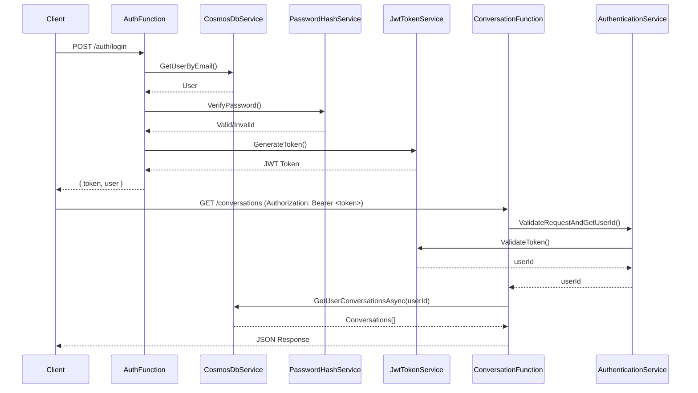
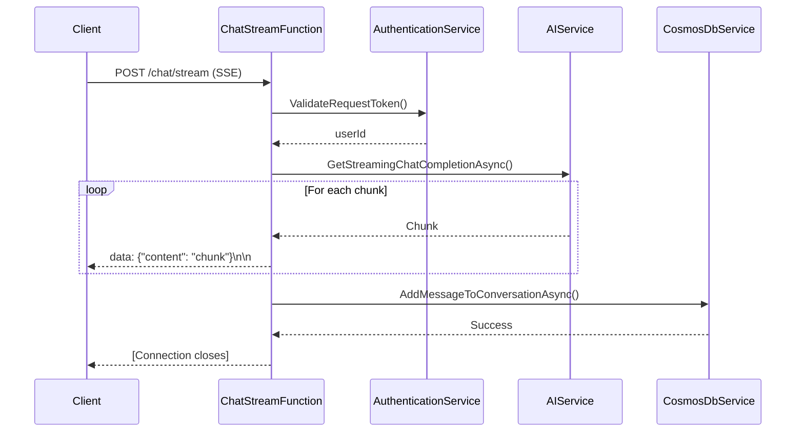

# Backend Architecture Documentation

## Overview

The backend is built using **Azure Functions v4** with the **.NET 8.0 isolated worker**, following clean architecture principles with clear separation of concerns. It provides JWT-secured chat, conversation history, image upload, and admin-managed RAG over documents stored in Azure.

## Technology Stack

- **Runtime**: .NET 8.0 (isolated worker model)
- **Framework**: Azure Functions v4
- **Database**: Azure Cosmos DB (NoSQL, database `ai_chat`)
- **Storage**: Azure Blob Storage (container `ai-chat` for images and documents)
- **AI Service**: Azure AI / Azure OpenAI (GPT-4.1 chat + `text-embedding-3-small` embeddings)
- **Search**: Azure AI Search (index `ai-chat-documents` for RAG)
- **Authentication**: JWT (JSON Web Tokens) with HS256
- **Password Hashing**: BCrypt.Net-Next

## Project Structure

```
backend/
├── Functions/              # HTTP-triggered Azure Functions
│   ├── AuthFunction.cs             # User authentication endpoints
│   ├── AdminFunction.cs            # Admin-only endpoints
│   ├── ConversationFunction.cs     # Conversation CRUD operations
│   ├── ChatFunction.cs             # Legacy non-streaming chat
│   ├── ChatStreamFunction.cs       # Streaming chat endpoint (SSE)
│   ├── ImageUploadFunction.cs      # Image upload for chat
│   ├── DocumentManagementFunction.cs # Admin document upload + RAG management
│   ├── HealthCheckFunction.cs      # Simple health probe
│   └── DocumentProcessingFunction.cs # (legacy queue trigger, not used in current flow)
├── Services/               # Business logic and external integrations
│   ├── IAuthenticationService.cs / AuthenticationService.cs
│   ├── IJwtTokenService.cs / JwtTokenService.cs
│   ├── IPasswordHashService.cs / PasswordHashService.cs
│   ├── ICosmosDbService.cs / CosmosDbService.cs
│   ├── IAIService.cs / AIService.cs
│   ├── IBlobStorageService.cs / BlobStorageService.cs
│   ├── IAISearchService.cs / AISearchService.cs
│   ├── IDocumentProcessingService.cs / DocumentProcessingService.cs
│   └── IDocumentParserService.cs / DocumentParserService.cs
├── Models/                 # Data models
│   ├── User.cs / UserRole.cs
│   ├── Conversation.cs
│   ├── Message.cs          # Messages with images, documents, citations
│   ├── ImageAttachment.cs
│   ├── DocumentAttachment.cs
│   ├── Document.cs / DocumentStatus.cs / DocumentMetadata.cs
│   ├── DocumentChunk.cs / DocumentCitation.cs
│   ├── ChatRequest.cs
│   └── ChatResponse.cs
├── Setup/                  # Initialization logic
│   ├── CosmosDbSetup.cs    # Database/container initialization
│   └── AdminSetup.cs       # Admin user creation
├── Program.cs              # Dependency injection and startup
└── local.settings.json     # Local configuration

```

## Architecture Patterns

### 1. Dependency Injection

All services are registered in `Program.cs` and injected into functions:

```csharp
builder.Services.AddSingleton<ICosmosDbService, CosmosDbService>();
builder.Services.AddSingleton<IAIService, AIService>();
builder.Services.AddSingleton<IPasswordHashService, PasswordHashService>();
builder.Services.AddSingleton<IJwtTokenService, JwtTokenService>();
builder.Services.AddSingleton<IAuthenticationService, AuthenticationService>();
```

### 2. Service Layer Pattern

Business logic is encapsulated in services, not in functions. Functions are thin controllers that:

1. Validate authentication
2. Call service methods
3. Return formatted responses

### 3. Repository Pattern (Implicit)

`CosmosDbService` acts as a repository, abstracting database operations from business logic.

### 4. Interface Segregation

Each service has a corresponding interface, enabling:

- Easy unit testing with mocks
- Loose coupling
- Clear contracts between layers

## Core Services

### AuthenticationService

**Purpose**: Centralized authentication and authorization logic

**Key Methods**:

- `ValidateRequestToken()` - Validates JWT and extracts user info
- `ValidateAdminRequest()` - Validates JWT and checks admin role
- `ValidateRequestAndGetUserId()` - Most common validation pattern

**Usage Pattern**:

```csharp
if (!_authService.ValidateRequestAndGetUserId(req, out string userId, out var errorResult))
{
    return errorResult!;
}
// Proceed with authenticated request
```

### JwtTokenService

**Purpose**: JWT token generation and validation

**Key Methods**:

- `GenerateToken(User user)` - Creates JWT with claims (id, email, name, role)
- `ValidateToken(string token, out string userId, out string email, out UserRole role)` - Validates and extracts claims

**Token Configuration**:

- Algorithm: HS256
- Expiration: 24 hours (configurable)
- Claims: nameid, email, unique_name, role, iss, aud, nbf, exp, iat

### CosmosDbService

**Purpose**: Database operations for users, conversations, messages, and RAG documents.

**Key Methods**:

- User operations: `CreateUserAsync()`, `GetUserByIdAsync()`, `GetUserByEmailAsync()`
- Conversation operations: `CreateConversationAsync()`, `GetUserConversationsAsync()`, `GetConversationByIdAsync()`, `DeleteConversationAsync()`
- Message operations: `AddMessageToConversationAsync()`, `GetMessagesForConversationAsync()`
- Document operations: `CreateDocumentAsync()`, `UpdateDocumentAsync()`, `GetDocumentsAsync()`, `DeleteDocumentAsync()`
- Admin queries: `GetAllUsersAsync()`, `GetAllConversationsAsync()`

**Database Structure**:

- Database: `ai_chat`
- Containers:
  - `Users` (partitioned by `/id`)
  - `Conversations` (partitioned by `/userId`)
  - `Messages` (partitioned by `/conversationId`)
  - `Documents` (partitioned by `/id`)

### AIService

**Purpose**: Integration with Azure AI / Azure OpenAI via Semantic Kernel.

**Key Methods**:

- `GetStreamingChatCompletionAsync()` - Yields streaming response chunks for SSE
- `GetChatCompletionAsync()` - Non-streaming completion (legacy)

**Features**:

- Server-Sent Events (SSE) streaming via `ChatStreamFunction`
- Conversation history context including images and document text
- Error handling and logging for AI service failures

### BlobStorageService

**Purpose**: Abstraction over Azure Blob Storage for images and documents.

**Responsibilities**:

- Upload images and documents into container `ai-chat`
- Organize blobs under `images/` and `documents/` prefixes
- Generate SAS URLs for secure, time-limited access

### AISearchService

**Purpose**: Access to Azure AI Search index (`ai-chat-documents`) for RAG.

**Responsibilities**:

- Index `DocumentChunk` records into the search index
- Perform hybrid searches to retrieve relevant chunks
- Map search results into `DocumentCitation` instances for the chat UI

### DocumentProcessingService

**Purpose**: End-to-end RAG document processing pipeline.

**Responsibilities**:

- Chunk raw document text into overlapping segments
- Summarize each chunk with Azure AI
- Generate embeddings (`text-embedding-3-small`) for content and summary
- Produce `DocumentChunk` objects ready for indexing

### PasswordHashService

**Purpose**: Secure password hashing and verification

**Key Methods**:

- `HashPassword(string password)` - BCrypt hash generation
- `VerifyPassword(string password, string hash)` - Password verification

**Security**: Uses BCrypt with automatic salt generation

## API Endpoints

### Authentication Endpoints (`/api/auth`)

| Method | Endpoint         | Auth | Description              |
| ------ | ---------------- | ---- | ------------------------ |
| POST   | `/auth/register` | ❌   | Create new user account  |
| POST   | `/auth/login`    | ❌   | Authenticate and get JWT |
| GET    | `/auth/me`       | ✅   | Get current user info    |

### Conversation Endpoints (`/api/conversations`)

| Method | Endpoint              | Auth | Description               |
| ------ | --------------------- | ---- | ------------------------- |
| POST   | `/conversations`      | ✅   | Create new conversation   |
| GET    | `/conversations`      | ✅   | List user's conversations |
| GET    | `/conversations/{id}` | ✅   | Get conversation details  |
| DELETE | `/conversations/{id}` | ✅   | Delete conversation       |

### Chat Endpoints (`/api/chat`)

| Method | Endpoint       | Auth | Description               |
| ------ | -------------- | ---- | ------------------------- |
| POST   | `/chat/stream` | ✅   | Stream AI responses (SSE) |

### Admin Endpoints (`/api/admin`)

| Method | Endpoint       | Auth     | Description             |
| ------ | -------------- | -------- | ----------------------- |
| GET    | `/admin/users` | 🔐 Admin | List all users          |
| GET    | `/admin/stats` | 🔐 Admin | Get platform statistics |

## Authentication Flow



## Streaming Chat Flow



## Data Models

### User Model

```csharp
public class User
{
    public string Id { get; set; }           // Unique identifier
    public string Email { get; set; }        // Email (unique)
    public string PasswordHash { get; set; } // BCrypt hash
    public string Name { get; set; }         // Display name
    public UserRole Role { get; set; }       // User or Admin
    public DateTime CreatedAt { get; set; }  // Account creation
    public DateTime UpdatedAt { get; set; }  // Last modification
}

public enum UserRole { User, Admin }
```

### Message Model

```csharp
public class Message
{
    public string Id { get; set; }                    // Unique identifier
    public string ConversationId { get; set; }        // Conversation reference
    public string Role { get; set; }                  // "user" or "assistant"
    public string Content { get; set; }               // Message text
    public DateTime CreatedAt { get; set; }           // Timestamp
    public List<ImageAttachment>? Images { get; set; }    // Optional image attachments
    public List<DocumentAttachment>? Documents { get; set; } // Optional document attachments
    public List<DocumentCitation>? Citations { get; set; }   // RAG sources for assistant replies
}
```

## Configuration

Configuration is managed through `local.settings.json`:

```json
{
	"Values": {
		"AzureWebJobsStorage": "DefaultEndpointsProtocol=https;AccountName=...;AccountKey=...;EndpointSuffix=core.windows.net",
		"CosmosDb:Endpoint": "https://...",
		"CosmosDb:Key": "...",
		"CosmosDb:DatabaseName": "ai_chat",
		"AzureAI:Endpoint": "https://...",
		"AzureAI:ApiKey": "...",
		"AzureAI:DeploymentName": "gpt-4.1",
		"AzureAI:EmbeddingDeployment": "text-embedding-3-small",
		"AzureSearch:Endpoint": "https://...search.windows.net",
		"AzureSearch:ApiKey": "...",
		"AzureSearch:IndexName": "ai-chat-documents",
		"AzureStorage:AccountName": "yourstorageaccount",
		"AzureStorage:AccountKey": "...",
		"AzureStorage:ContainerName": "ai-chat",
		"AzureStorage:ImageFolder": "images",
		"AzureStorage:DocumentFolder": "documents",
		"DocumentProcessing:ChunkSize": "800",
		"DocumentProcessing:ChunkOverlap": "200",
		"RAG:MinRelevanceScore": "0.7",
		"RAG:MaxResults": "3",
		"RAG:SemanticWeight": "0.7",
		"Jwt:SecretKey": "...",
		"Jwt:Issuer": "AIChatBot",
		"Jwt:Audience": "AIChatBot",
		"Jwt:ExpirationMinutes": "1440",
		"Admin:Email": "admin@aichatbot.com",
		"Admin:Password": "Admin@123456",
		"Admin:Name": "Administrator"
	}
}
```

## Initialization Process

On startup (`Program.cs`):

1. **Dependency Injection** - Register all services
2. **Cosmos DB Initialization** - Create database and containers if they don't exist
3. **Admin User Creation** - Create admin account if it doesn't exist

## Error Handling

All endpoints follow consistent error response patterns:

| Status Code | Meaning      | Response                                  |
| ----------- | ------------ | ----------------------------------------- |
| 200         | Success      | `{ ...data }`                             |
| 400         | Bad Request  | `{ "error": "Message is required" }`      |
| 401         | Unauthorized | `{ "error": "Invalid or expired token" }` |
| 403         | Forbidden    | `{ "error": "Admin access required" }`    |
| 404         | Not Found    | `{ "error": "Conversation not found" }`   |
| 409         | Conflict     | `{ "error": "User already exists" }`      |
| 500         | Server Error | `{ "error": "Failed to..." }`             |

## Security Features

1. **Password Hashing**: BCrypt with automatic salt generation
2. **JWT Authentication**: HS256 algorithm with configurable expiration
3. **Role-Based Access Control**: User and Admin roles
4. **User Isolation**: All queries filtered by userId from JWT
5. **CORS Protection**: Configured for specific frontend origins

## Performance Considerations

1. **Singleton Services**: All services are registered as singletons for efficiency
2. **Streaming Responses**: Large AI responses streamed to prevent memory issues
3. **Cosmos DB Partition Keys**: Efficient queries using userId as partition key
4. **Async/Await**: All I/O operations are asynchronous

## Testing Strategy

### Unit Tests (Recommended)

- `AuthenticationService` - Mock IJwtTokenService
- `JwtTokenService` - Test token generation and validation
- `PasswordHashService` - Test hashing and verification
- `CosmosDbService` - Mock CosmosClient

### Integration Tests (Recommended)

- End-to-end authentication flow
- Conversation CRUD operations
- Admin endpoint authorization
- Chat streaming functionality

## Deployment Considerations

### Azure Resources Required

1. **Azure Function App** (.NET 10 Isolated)
2. **Azure Cosmos DB** (Serverless recommended for dev/test)
3. **Azure AI Foundry** (GPT-4.1 deployment)
4. **Application Insights** (Optional, currently disabled)

### Environment Variables

All values from `local.settings.json` must be configured as Application Settings in Azure

### Scaling

- Functions scale automatically based on load
- Cosmos DB provisioned throughput or serverless mode
- Consider connection pooling for production

## Future Enhancements

1. **Caching Layer**: Redis for frequently accessed data
2. **Message Queue**: Azure Service Bus for async processing
3. **Blob Storage**: Store large conversation histories
4. **Telemetry**: Enable Application Insights
5. **Rate Limiting**: Per-user API rate limits
6. **Pagination**: For large conversation lists
7. **Soft Deletes**: Recoverable conversation deletion
8. **Audit Logging**: Track all admin actions
